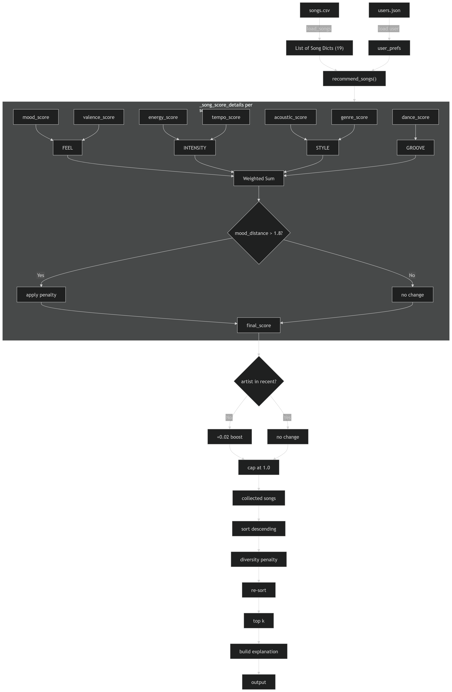

# Music Recommender Simulation

---

## Project Summary

This project builds a small content-based music recommender system. Given a user taste profile, it scores every song in a catalog and returns the top matches — ranked by how closely each song fits what the user wants right now.

The system is built around a single core idea: **proximity scoring**. Instead of rewarding songs that are simply "high energy" or "low energy," it rewards songs whose attributes are *closest* to the user's target values.

Three distinct user profiles (alex, jordan, sam) are stored in [data/users.json](data/users.json). Switching the `ACTIVE_USER` variable in [src/main.py](src/main.py) runs the recommender for a different person and produces a completely different set of results.

---

## How The System Works

Real-world recommenders like Spotify and YouTube combine two strategies: they look at the attributes of songs you have liked (content-based filtering), and they look at what other users with similar taste have enjoyed (collaborative filtering). This simulation has three user profiles and a nineteen-song catalog, and uses content-based filtering exclusively — comparing each user's stated preferences directly against each song's measurable attributes. Every recommendation comes with a plain-language reason, every score can be traced back to a specific feature comparison, and the math stays simple enough to reason about by hand.

---

### The Dataset

The catalog lives in [data/songs.csv](data/songs.csv) and contains **19 songs** across 16 genres.

Each song stores these features:

| Feature | Type | Range | What it captures |
|---|---|---|---|
| `genre` | text | pop, lofi, rock, ambient, jazz, synthwave, indie pop, folk, edm, metal, r&b, classical, hip-hop, electronic, blues, k-pop | Broad style category |
| `mood` | text | happy, chill, intense, relaxed, moody, focused, sad, excited, angry | Emotional intent |
| `energy` | float | 0.0 – 1.0 | Intensity and perceived loudness |
| `tempo_bpm` | float | 58 – 168 | Beats per minute |
| `valence` | float | 0.0 – 1.0 | Musical positivity (sad → joyful) |
| `danceability` | float | 0.0 – 1.0 | Rhythmic drive and groove |
| `acousticness` | float | 0.0 – 1.0 | Organic texture vs electronic production |

Genres in catalog: lofi (3), pop (2), rock (1), ambient (1), jazz (1), synthwave (1), indie pop (1), folk (1), edm (1), metal (1), r&b (1), classical (1), hip-hop (1), electronic (1), blues (1), k-pop (1)

Moods in catalog: chill (3), happy (3), intense (2), sad (2), moody (2), relaxed (2), focused (2), excited (2), angry (1)

---

### User Profile

User profiles live in [data/users.json](data/users.json). Each profile is a dictionary with these keys:

- `genre` — primary genre preference
- `favorite_genres` — ranked fallback list (first = most preferred)
- `mood` — target emotional vibe
- `energy` — preferred energy level (0.0–1.0)
- `tempo_bpm` — preferred tempo in beats per minute
- `likes_acoustic` — `true` = prefers organic/live sound, `false` = prefers produced/electronic
- `recent_songs` — list of recently played dicts with an `artist` key (used to apply a novelty boost to new artists)

To switch the active user, change `ACTIVE_USER` at the top of [src/main.py](src/main.py).

---

### Algorithm Recipe

This is the exact sequence of steps the program follows to turn a user profile into a ranked list of songs.

**Overview:**

```
data/songs.csv          data/users.json
      │                       │
      ▼                       ▼
 load_songs()           json.load()
 → List[Dict]           profiles[ACTIVE_USER]
      │                       │
      └──────────┬────────────┘
                 ▼
        recommend_songs(user_prefs, songs, k=5)
                 │
                 ├─── for each of 19 songs ──→ _song_score_details()
                 │                                      │
                 │                             returns final_score
                 │
                 ├─── novelty boost pass
                 ├─── sort descending
                 ├─── artist diversity pass + re-sort
                 ├─── slice top k
                 └─── _build_explanation() for each
                 │
                 ▼
       List[ (song_dict, score, explanation) ]
                 │
                 ▼
            print to terminal

```
#### Possible Bias

Mood carries the highest weight (0.28) while genre carries the lowest (0.06). This means the system can consistently surface songs in the wrong genre as long as they match the user's emotional state. Over time, a user stuck in a "chill" or "sad" mood would receive an increasingly narrow set of mood-matched songs, with little incentive for the system to introduce variety across genre or arousal level — reinforcing the current mood rather than offering a path out of it.
---

#### Proximity Scoring for Numerical Features

The recommender computes a final score between 0.0 and 1.0 for each song. A feature score does **not** reward songs that are simply high or low on a scale — it rewards songs that are **closest to the user's target value**.

The formula is **linear proximity**:

```
proximity_score = max(0,  1 − |user_value − song_value| / span)
```

- `user_value` — what the user wants (e.g., target energy = 0.5)
- `song_value` — the song's measured value (e.g., energy = 0.9)
- `span` — the expected range of that feature (e.g., 1.0 for energy, 80 for tempo)
- `max(0, ...)` — clamps the score so it never goes negative

**Example — energy scoring:**

```
User wants energy = 0.5
Song A energy   = 0.52  →  score = 1 − |0.5 − 0.52| / 1.0 = 0.98  ✓ great match
Song B energy   = 0.90  →  score = 1 − |0.5 − 0.90| / 1.0 = 0.60  partial match
Song C energy   = 0.05  →  score = 1 − |0.5 − 0.05| / 1.0 = 0.55  partial match
```

Both Song B and Song C are equally "wrong" in opposite directions and are penalized equally. The same formula applies to `tempo_bpm` (span = 80), `valence` (span = 1.0), `danceability` (span = 1.0), and `acousticness` (span = 1.0).

---

#### Mood Scoring

Mood is a text label, not a number. To compare moods continuously, each mood is mapped to a 2D coordinate:

| Mood | X (valence) | Y (arousal) |
|---|---|---|
| happy | 0.8 | 0.2 |
| excited | 0.9 | 0.9 |
| intense | 0.7 | 0.95 |
| focused | 0.3 | −0.1 |
| chill | 0.0 | −0.8 |
| relaxed | 0.2 | −0.7 |
| moody | −0.3 | 0.2 |
| sad | −1.0 | −0.4 |
| angry | −0.7 | 0.8 |

The X axis runs from negative to positive feeling. The Y axis runs from calm to intense. The maximum possible distance between any two moods in this space is √8 ≈ 2.83.

```
mood_score = max(0,  1 − euclidean_distance(user_mood, song_mood) / 2.83)
```

Adjacent moods (e.g., chill → relaxed) score higher than opposite moods (e.g., happy → sad), rather than treating all mismatches the same.

---

#### Genre Scoring

Genre is matched exactly against the primary preference, with partial credit for the fallback list:

```
genre_score = 1.0     if song genre == primary genre
genre_score = 0.9     if song genre is 1st in favorite_genres list
genre_score = 0.8     if song genre is 2nd in favorite_genres list
genre_score = 0.0     if song genre is not in any list
```

---

#### Final Weighted Score

All sub-scores are combined with fixed weights:

```
final_score =
    0.28 × mood_score
  + 0.20 × energy_score
  + 0.18 × acousticness_score
  + 0.15 × valence_score
  + 0.10 × tempo_score
  + 0.06 × genre_score
  + 0.03 × danceability_score
```

**Why these weights?**

- **Mood (0.28)** — the primary holistic signal; maps the user's stated emotional state to the 2D valence × arousal space
- **Energy (0.20)** — the arousal axis; the clearest single separator between calm and intense songs in this catalog
- **Acousticness (0.18)** — the strongest stylistic divider; cleanly separates organic/textural songs (lofi, jazz, ambient) from electronic/produced ones (synthwave, pop, rock)
- **Valence (0.15)** — the emotional tone axis; distinguishes "high-energy dark" from "high-energy happy" — something energy alone cannot do
- **Tempo (0.10)** — adds rhythmic pacing precision; much of its signal is already captured by energy
- **Genre (0.06)** — useful soft filter but too sparse at this catalog size to be a primary signal
- **Danceability (0.03)** — mostly captured by energy and tempo combined; kept as a minor refiner


---

## Getting Started

### Setup

1. Create a virtual environment (optional but recommended):

   ```bash
   python -m venv .venv
   source .venv/bin/activate      # Mac or Linux
   .venv\Scripts\activate         # Windows
   ```

2. Install dependencies:

   ```bash
   pip install -r requirements.txt
   ```

3. Run the app:

   ```bash
   python -m src.main
   ```

### Running Tests

```bash
pytest
```

You can add more tests in `tests/test_recommender.py`.

---

## Experiments You Tried

Use this section to document experiments. For example:

- What happened when you changed the weight on genre vs energy
- What happened when you tested a user who likes "intense" vs "chill"
- How did the artist diversity penalty change the top-k list

---

## Limitations and Risks

- **Tiny catalog (19 songs)**: with only 1 song per genre for most genres, genre scoring frequently returns 0.0 across the board — limiting its usefulness
- **No collaborative signal**: the system never learns from what other users liked; it can only match attributes, not discover cross-genre surprises
- **Cold start on new songs**: a newly added song with no listening history gets no boost from popularity or engagement
- **Correlated features**: energy and acousticness are inversely correlated in this dataset, so they partially double-count the same information
- **Fixed weights**: the same weights apply to every user; a user who cares deeply about genre but not tempo gets no way to express that

---

## Reflection

Read and complete [model_card.md](model_card.md).

Write 1–2 paragraphs here about what you learned:

- About how recommenders turn data into predictions
- About where bias or unfairness could show up in systems like this
