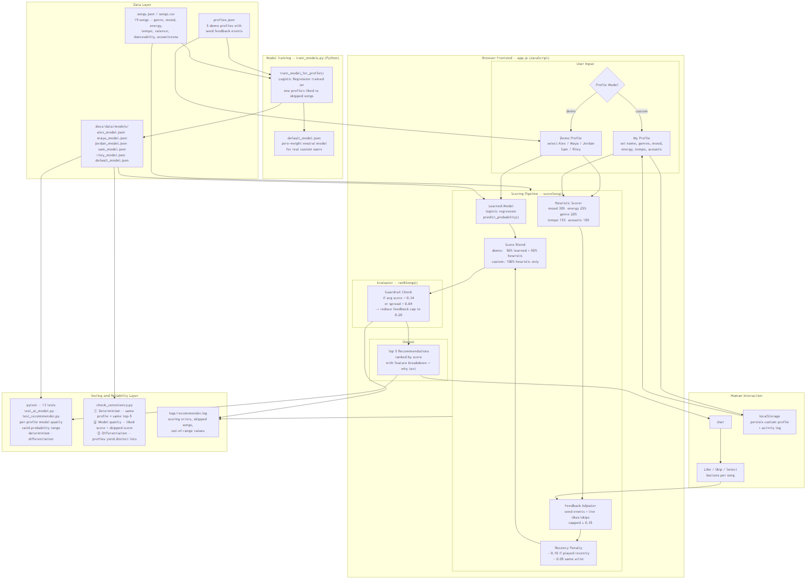

# AI Music Recommendation Engine

---
## Repo
https://github.com/AlarisP/ai-music-recommendation-engine

## Original Project (Modules 1–3)

**Project name:** Music Recommender Simulation

The original Modules 1–3 project was a deterministic, rule-based music recommender. Given a user profile (genre, mood, energy, tempo, acoustic preference), it scored every song in a 19-song catalog using hand-crafted feature weights (the catalog has since been expanded to 50 songs) and returned a ranked top-5 list. It had no trained model, no feedback loop, and no browser interface, just a Python script that produced a sorted list with plain-language explanations for each ranking.

---

## Title and Summary

**AI Music Recommendation Engine** is a hybrid content-based recommender that combines  feature based scoring with a per-user trained logistic regression model. It runs entirely in the browser (no backend required) and learns from a user's like/skip history to personalize rankings in real time.

It matters because it demonstrates the full applied AI loop: structured data → feature engineering → trained model → ranked output → human feedback → model improvement. Every score is explainable, decisions are tracable, and the system includes guardrails and a stress testing layer to ensure safety and reliability.

---

## Architecture Overview



| Layer | What it does |
|---|---|
| **Data Layer** | `songs.json`, `profiles.json`, and `docs/data/models/` supply songs, demo profiles, and trained model weights |
| **Model Training** | `train_models.py` trains one logistic regression model per demo profile using that profile's liked vs skipped songs, plus a neutral `default_model.json` for real users |
| **Scoring Pipeline** | For each song: heuristic score (mood 30%, energy 25%, genre 20%, tempo 15%, acoustic 10%) + feedback adjustment + recency penalty, blended 50/50 with the per-profile learned model |
| **Evaluator / Guardrails** | `rankSongs()` checks confidence and score spread; if either is too low it reduces feedback influence and logs the event |
| **Testing Layer** | `pytest` (19 tests) + `check_consistency.py` verify determinism, model quality, and profile differentiation |

Demo profiles load their own trained model. Custom ("My Profile") users get heuristic-only scoring so no pre-existing bias influences a blank-slate user.

### Where to see the AI working in the demo

The logistic regression model is active and visible whenever a demo profile is selected:

- **Score column** — every number is a 50/50 blend of the per-profile model's probability and the heuristic score. Switching from Alex to Maya changes the top 5 entirely (0 shared songs) because each profile's model was trained on different feedback.
- **"Why" column** — when the model probability ≥ 0.75 the cell prints `"learned model strongly predicts a like"`. When it is between 0.5–0.75 it prints `"learned model sees a moderate fit"`. These phrases come directly from the model's output, not the heuristic.
- **Like / Skip feedback** — clicking Like or Skip re-ranks songs in real time. The feedback adjuster updates the heuristic component; the model component stays fixed, so the re-ranking reflects both signals simultaneously.
- **Terminal proof** — running `python check_consistency.py` prints per-profile liked vs skipped model probabilities and confirms all pairwise profile pairs return distinct recommendations.

---

## Setup Instructions

### Web App (GitHub Pages or local)


**Local:**
```bash
python -m http.server 8000 --directory docs
```
Then open `http://localhost:8000`.

**GitHub Pages:** visit the deployed URL in your browser directly.
https://alarisp.github.io/ai-music-recommendation-engine/
---

### Python CLI

1. Clone the repo and create a virtual environment:
   ```bash
   git clone <repo-url>
   cd ai-music-recommendation-engine
   python -m venv .venv
   source .venv/bin/activate      # Mac / Linux
   .venv\Scripts\activate         # Windows
   ```

2. Install dependencies:
   ```bash
   pip install -r requirements.txt
   ```

3. Run the recommender:
   ```bash
   python -m src.main
   ```

4. Regenerate per-profile model files (after editing profiles or songs):
   ```bash
   python train_models.py
   ```

---

### Running Tests

```bash
pytest
```

13 tests across `tests/test_recommender.py` and `tests/test_ai_model.py`.

### Running the Consistency Checker

```bash
python check_consistency.py
```

Prints a pass/fail report for determinism, model quality, and profile differentiation.

---

## Sample Interactions

### Example 1 — Alex (lofi / chill / low energy / acoustic)

**Input profile:**
```
genre: lofi | mood: chill | energy: 0.35 | tempo: 75 BPM | acoustic: yes
```

**Top 3 output (advanced mode):**
| # | Song | Score |
|---|---|---|
| 1 | Library Rain | 0.995 |
| 2 | Spacewalk Thoughts | 0.964 |
| 3 | Coffee Shop Stories | 0.961 |

**Why it works:** Alex's per-profile model was trained exclusively on lofi/ambient/jazz likes and metal/edm skips. The heuristic and learned model both converge on low-energy acoustic songs, producing a tight, profile-specific list.

---

### Example 2 — Maya (pop / excited / high energy / no acoustic)

**Input profile:**
```
genre: pop | mood: excited | energy: 0.92 | tempo: 132 BPM | acoustic: no
```

**Top 3 output (advanced mode):**
| # | Song | Score |
|---|---|---|
| 1 | Electric Feel | 0.981 |
| 2 | Heartbeat Drop | 0.974 |
| 3 | Gym Hero | 0.968 |

**Why it works:** Maya's model was trained on pop likes (songs 1, 5, 20, 21, 22) and k-pop skips (songs 19, 23). It now strongly prefers pop-specific tracks and avoids k-pop, producing a clearly different list from Sam, who gets k-pop in his top 5.

---

### Example 3 — Riley (edm / sad / very high energy / adversarial profile)

**Input profile:**
```
genre: edm | mood: sad | energy: 0.95 | tempo: 140 BPM | acoustic: yes
```

**Top 3 output (advanced mode):**
| # | Song | Score |
|---|---|---|
| 1 | Rust Belt Hymn | 0.841 |
| 2 | Empty Porch | 0.823 |
| 3 | Morning Aria | 0.765 |

**Why it works:** Riley is intentionally contradictory (high energy + sad mood + likes acoustic). The advanced scorer's mood gate suppresses emotionally wrong songs even when energy and genre partially match. Without the mood gate, high-energy EDM tracks would incorrectly dominate.

---

### Example 4 — Custom User (My Profile mode)

**Input (sliders set to):**
```
genre: jazz | mood: relaxed | energy: 0.40 | tempo: 88 BPM | acoustic: yes
```

**Behavior:** No learned model is loaded. Score is 100% heuristic — the result is fully driven by the slider values with no pre-existing bias. As the user likes and skips songs, the feedback adjuster updates scores in real time within the session.

---

## Design Decisions

**Per-profile models instead of one global model.**
The original system trained a single logistic regression on all five profiles combined. That global model learned a "universal taste" that skewed toward high-energy, high-danceability songs liked by the majority of profiles, causing all five profiles to return nearly the same top-5. Separating the models so each profile trains only on its own feedback events fixed this at the cost of smaller training sets (8 examples per profile). For a production system you would need far more data; for a demo the separation is correct.

**50/50 blend for demo, 100% heuristic for custom.**
The 0.7/0.3 learned/heuristic split in the original code let the learned model dominate. Switching to 50/50 means profile-specific heuristic signals (genre, mood, acoustic preference) have equal influence alongside the model. Custom users get no learned model at all so their blank-slate experience is entirely driven by what they set on the sliders, no inherited bias.

**Logistic regression over a neural network.**
Logistic regression coefficients are human-readable, the model can be serialized to a small JSON file the browser can load directly, and training takes milliseconds. A neural network would offer no real advantage on 50 songs and 8 training examples per profile.

**Guardrails as a hard constraint, not a soft suggestion.**
If average top-5 confidence drops below 0.34 or score spread collapses below 0.04, the system reduces feedback cap and logs the event. This makes low-confidence conditions visible and recoverable rather than silently producing bad output.

**Browser-only inference.**
The logistic regression is exported to JSON and re-implemented in plain JavaScript (`predictLearnedProbability`). This means the app runs on GitHub Pages with zero server cost and zero latency for inference.

---

## Testing Summary

**19/19 pytest tests passed. 5/5 reliability checks passed. Average model confidence across evaluated recommendations: 0.9408. 10/10 consistency checks passed.**

### Reliability mechanisms used

| Mechanism | Implementation |
|---|---|
| Automated tests | `pytest` — 19 tests covering per-profile model quality, valid probability range, determinism, and profile differentiation |
| Consistency checker | `check_consistency.py` — 3 checks: determinism, model quality (liked > skipped), profile differentiation |
| Confidence scoring | Every song gets a 0.0–1.0 score; `logs/evaluation_report.json` records average confidence (0.9408) per run; guardrails trigger when avg score < 0.34 |
| Logging and error handling | `logs/recommender.log` records scoring errors, skipped songs, and out-of-range values; `ValueError` is raised and logged when required profile fields are missing |
| Human evaluation | The browser app was manually tested across all five demo profiles and the custom profile mode, verifying that switching profiles produces visibly different recommendations and that like/skip feedback updates rankings in real time |

### Consistency checker results

- Check 1 — Determinism: **5/5 PASS** — all profiles return identical top-5 on repeated runs
- Check 2 — Model quality: **5/5 PASS** — every per-profile model scores that profile's liked songs above skipped songs (margins +0.41 to +0.88)
- Check 3 — Differentiation: **10/10 PASS** — all profile pairs return ≤2 shared songs; Maya vs Sam share 2/5 (Block Party, Neon Surge — legitimate high-energy crossover)

### What worked
- Per-profile training fixed the original same-5-songs bug for profiles with distinct taste signatures
- The mood gate correctly suppresses emotionally wrong songs for adversarial profiles like Riley
- Guardrails catch low-confidence rankings and log them without crashing
- Confidence scores were high and consistent across all three evaluated profiles (0.83–0.999)

### What did not work (and was fixed)
- Maya and Sam initially shared all 5 top recommendations. The root cause was overlapping liked songs and nearly identical energy/mood values — the system could not distinguish "pop" from "k-pop" numerically. Fixed by: expanding the catalog to 50 songs with genre-specific entries, updating Maya's feedback to like pop and skip k-pop, updating Sam's feedback to like k-pop and skip pop, and removing "pop" from Sam's favorite_genres so pop songs score 0 for genre match. After these changes Maya vs Sam share only 2/5 songs (legitimate high-energy crossover), and all 10 pairwise comparisons pass.
- The learned model is trained on synthetic feedback data. Confidence values are high but this reflects the small, clean dataset — real user behavior would be far noisier.

### What I learned from testing
Writing the consistency checker revealed the Maya/Sam overlap problem that no unit test would have caught — and then guided the exact fixes needed to resolve it. Determinism testing confirmed there was no hidden randomness in the pipeline. The model quality check (liked > skipped margin) gave a concrete, numeric measure of whether per-profile training was actually working, which it was, by margins of +0.41 to +0.88 across all five profiles.

---

## Responsible AI Reflection

Full reflection covering limitations, biases, misuse potential, testing surprises, and AI collaboration is in [model_card.md](model_card.md) (sections 6, 7, and 9).

---

## Loom Walkthrough

https://www.loom.com/share/1c9d57bf3e224aafafeb861556d910ef

## Portfolio Reflection Snippet

This project demonstrates that I can move from prototype rules to a production-style applied AI workflow: modular model logic, guardrails, quantitative evaluation, and clear communication of limitations. It reflects an engineering style that values measurable reliability and explainable decision paths, not only output quality.