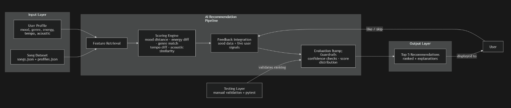

# Music Recommender Simulation

---
## Project Summary

This project builds a small content-based music recommender system. Given a user taste profile, it scores every song in a catalog and returns the top matches — ranked by how closely each song fits what the user wants right now.

The system is built around a single core idea: **proximity scoring**. Instead of rewarding songs that are simply "high energy" or "low energy," it rewards songs whose attributes are *closest* to the user's target values.

User profiles are currently defined in [src/main.py](src/main.py) under `USER_PROFILES`. Switching the `ACTIVE_USER` variable in [src/main.py](src/main.py) runs the recommender for a different person and produces a different set of results. A second variable, `SCORING_MODE`, lets you choose between two different ranking algorithms without touching any other code.

The core recommendation stack now includes [src/scorers.py](src/scorers.py), [src/ai_model.py](src/ai_model.py), and [src/recommender.py](src/recommender.py). The `Recommender` class defaults to `advanced` mode, but you can still switch to `simple` when you want the lighter weighted-sum version. A feedback-trained logistic regression model is blended into ranking, so the project now has a real learned AI component rather than only handcrafted rules.

### Original Module 1-3 Base Project

This final system extends the earlier "Music Recommender Simulation" prototype from Modules 1-3. The original version focused on deterministic, feature-based ranking of songs using user preferences for genre, mood, and energy, with no trained model layer. The current version preserves that explainable baseline, then upgrades it with a learned preference model, explicit guardrails, and a reliability evaluation harness.

---

## How The System Works

Real-world recommenders like Spotify and YouTube combine two strategies: they look at the attributes of songs you have liked (content-based filtering), and they look at what other users with similar taste have enjoyed (collaborative filtering). This simulation has five user profiles and a nineteen-song catalog, and uses content-based filtering exclusively, comparing each user's stated preferences directly against each song's measurable attributes. Every recommendation comes with a plain-language reason, every score can be traced back to a specific feature comparison, and the math stays simple enough to reason about by hand.

---

### The Dataset

The catalog lives in [data/songs.csv](data/songs.csv) and contains **19 songs** across 16 genres.

Each song stores these features:

| Feature | Type | Range | What it captures |
|---|---|---|---|
| `genre` | text | pop, lofi, rock, ambient, jazz, synthwave, indie pop, folk, edm, metal, r&b, classical, hip-hop, electronic, blues, k-pop | Broad style category |
| `mood` | text | happy, chill, intense, relaxed, moody, focused, sad, excited, angry | Emotional intent |
| `energy` | float | 0.0 – 1.0 | Intensity and perceived loudness |
| `tempo_bpm` | float | 58 – 168 | Beats per minute |
| `valence` | float | 0.0 – 1.0 | Musical positivity (sad → joyful) |
| `danceability` | float | 0.0 – 1.0 | Rhythmic drive and groove |
| `acousticness` | float | 0.0 – 1.0 | Organic texture vs electronic production |

Genres in catalog: lofi (3), pop (2), rock (1), ambient (1), jazz (1), synthwave (1), indie pop (1), folk (1), edm (1), metal (1), r&b (1), classical (1), hip-hop (1), electronic (1), blues (1), k-pop (1)

Moods in catalog: chill (3), happy (3), intense (2), sad (2), moody (2), relaxed (2), focused (2), excited (2), angry (1)

---

### User Profile

User profiles are currently defined in [src/main.py](src/main.py). Each profile is a dictionary with these keys:

- `genre` — primary genre preference
- `favorite_genres` — ranked fallback list (first = most preferred)
- `mood` — target emotional vibe
- `energy` — preferred energy level (0.0–1.0)
- `tempo_bpm` — preferred tempo in beats per minute
- `likes_acoustic` — `true` = prefers organic/live sound, `false` = prefers produced/electronic
- `recent_songs` — list of recently played dicts with an `artist` key (used to apply a novelty boost to new artists)

To switch the active user, change `ACTIVE_USER` at the top of [src/main.py](src/main.py).

To switch the scoring algorithm, change `SCORING_MODE` at the top of [src/main.py](src/main.py):

```python
SCORING_MODE = "simple"    # additive weighted sum
SCORING_MODE = "advanced"  # grouped dimensions + mood gate penalty
```

See [Scoring Modes](#scoring-modes) below for a full comparison.

If you are using the OOP API directly, `Recommender(songs)` defaults to `advanced` mode. Pass `mode="simple"` to use the additive scorer instead.

---

### Algorithm Recipe

This is the exact sequence of steps the program follows to turn a user profile into a ranked list of songs.

**Overview:**

See the short system diagram below for the full input -> process -> output flow.

### Short System Diagram

Diagram source: `Assets/system_diagram.mmd`


This diagram shows:

- main components (`Feature Retriever`, `Scoring Agent`, `Evaluator and Guardrails`, `Testing Layer`)
- data flow (`User Input -> Retriever -> Scoring -> Feedback -> Evaluator -> Output`)
- where humans and testing validate AI behavior (`Human User` feedback loop and `Testing Layer` checks)

#### Proximity Scoring for Numerical Features

The helper computes similarity values between 0.0 and 1.0 for each feature. A feature score does **not** reward songs that are simply high or low on a scale — it rewards songs that are **closest to the user's target value**.

The formula is **linear proximity**:

```
proximity_score = max(0,  1 − |user_value − song_value| / span)
```

- `user_value` — what the user wants (e.g., target energy = 0.5)
- `song_value` — the song's measured value (e.g., energy = 0.9)
- `span` — the expected range of that feature (e.g., 1.0 for energy, 80 for tempo)
- `max(0, ...)` — clamps the score so it never goes negative

**Example — energy scoring:**

```
User wants energy = 0.5
Song A energy   = 0.52  →  score = 1 − |0.5 − 0.52| / 1.0 = 0.98  ✓ great match
Song B energy   = 0.90  →  score = 1 − |0.5 − 0.90| / 1.0 = 0.60  partial match
Song C energy   = 0.05  →  score = 1 − |0.5 − 0.05| / 1.0 = 0.55  partial match
```

Both Song B and Song C are equally "wrong" in opposite directions and are penalized equally. The same formula applies to `tempo_bpm` (span = 80), `valence` (span = 1.0), `danceability` (span = 1.0), and `acousticness` (span = 1.0).

Those feature similarities are then converted into points in `score_song`.

---

#### Mood Scoring

Mood is a text label, not a number. To compare moods continuously, each mood is mapped to a 2D coordinate:

| Mood | X (valence) | Y (arousal) |
|---|---|---|
| happy | 0.8 | 0.2 |
| excited | 0.9 | 0.9 |
| intense | 0.7 | 0.95 |
| focused | 0.3 | −0.1 |
| chill | 0.0 | −0.8 |
| relaxed | 0.2 | −0.7 |
| moody | −0.3 | 0.2 |
| sad | −1.0 | −0.4 |
| angry | −0.7 | 0.8 |

The X axis runs from negative to positive feeling. The Y axis runs from calm to intense. The maximum possible distance between any two moods in this space is √8 ≈ 2.83.

```
mood_score = max(0,  1 − euclidean_distance(user_mood, song_mood) / 2.83)
```

Adjacent moods (e.g., chill → relaxed) score higher than opposite moods (e.g., happy → sad), rather than treating all mismatches the same.

---

#### Genre Scoring

Genre is matched exactly against the primary preference, with partial credit for the fallback list:

```
genre_score = 1.0     if song genre == primary genre
genre_score = 0.9     if song genre is 1st in favorite_genres list
genre_score = 0.8     if song genre is 2nd in favorite_genres list
genre_score = 0.0     if song genre is not in any list
```

---

#### Scoring Modes

`recommend_songs` supports two scoring algorithms, selected by `SCORING_MODE` in [src/main.py](src/main.py).

---

**`"simple"` — Additive Weighted Sum**

Each feature contributes a fixed number of points. The weights encode a design priority: genre and mood matter most, energy somewhat, texture and tone are tiebreakers.

```
score =
      2.0 × genre_score
   + 1.5 × mood_score
   + 1.0 × energy_score
   + 0.5 × acoustic_score
   + 0.5 × valence_score
```

Max possible score ≈ 5.5. Easy to reason about by hand — you can trace exactly why any song ranked where it did.

---

**`"advanced"` — Grouped Dimensions + Mood Gate**

Features are first combined into four perceptual groups, then the groups are weighted. This avoids double-counting correlated features (e.g. energy and tempo both measure intensity, so grouping them prevents them from each getting a full independent vote).

```
FEEL      = 0.65 × mood_score      + 0.35 × valence_score
INTENSITY = 0.70 × energy_score    + 0.30 × tempo_score
STYLE     = 0.55 × acoustic_score  + 0.45 × genre_score
GROOVE    = danceability_score

final_score =
      0.38 × FEEL
   + 0.30 × INTENSITY
   + 0.22 × STYLE
   + 0.10 × GROOVE
```

An additional **mood gate** applies a multiplicative penalty when user and song moods are near-opposites (distance > 1.8 in the 2D mood space). This prevents a song that is numerically close on energy or genre from overcoming a fundamentally wrong emotional vibe.

```
if mood_distance > 1.8:
    final_score *= max(0.5,  1 − (mood_distance − 1.8) / 2.83)
```

This mode tends to produce noticeably different results for users with contradictory signals (e.g. high energy + sad mood), where the mood gate suppresses high-energy songs that the simple mode would still rank highly.

---

**Shared post-scoring steps (both modes)**

After the base score is computed, both modes apply the same two adjustments:

- **Novelty bonus**: add `+0.1` when `recent_songs` is non-empty and the song's artist is not in recent history.
- **Artist diversity pass**: subtract `0.05 × prior_occurrences_of_artist` in rank order. Prevents one artist from dominating all top-k slots.
- **Genre diversity pass**: subtract `0.03 × prior_occurrences_of_genre` in rank order (applied alongside artist penalty). Softer than the artist penalty because genres are broader — but still nudges the list toward variety across styles, not just artists.


---

## Getting Started

### GitHub Pages Web App (No Backend)

This project now includes a browser-based recommender in `docs/` that can be deployed on GitHub Pages.

The web app scores songs using these core signals and also loads the exported learned model in `docs/data/preference_model.json`:

- user mood vs song mood distance
- user target energy vs song energy difference
- genre match flags
- tempo difference
- acoustic preference match

It also applies **user feedback learning** from seed profile events (`like`/`skip`) plus live feedback buttons in the UI. Feedback is stored in browser local storage and the exported model confidence is blended into the ranking.

#### Deploy to GitHub Pages

1. Push the repository to GitHub.
2. Go to **Settings → Pages**.
3. Under **Build and deployment**, choose:
   - **Source**: Deploy from a branch
   - **Branch**: `main`
   - **Folder**: `/docs`
4. Save, then wait for GitHub Pages to publish.
5. Open the published URL and use the profile selector to test recommendations.

#### Files used by the web app

- `docs/index.html` - UI
- `docs/app.js` - scoring logic, feedback integration, guardrails, and learned-model inference
- `docs/styles.css` - styling
- `docs/data/songs.json` - song catalog used by the browser app
- `docs/data/profiles.json` - in-depth example profiles with fake feedback histories
- `docs/data/preference_model.json` - exported trained model used by the browser app

### Setup

1. Create a virtual environment (optional but recommended):

   ```bash
   python -m venv .venv
   source .venv/bin/activate      # Mac or Linux
   .venv\Scripts\activate         # Windows
   ```

2. Install dependencies:

   ```bash
   pip install -r requirements.txt
   ```

3. Run the app:

   ```bash
   python -m src.main
   ```

### Running Tests

```bash
pytest
```

The test suite covers both scoring modes, invalid mode handling, and the OOP wrapper in `tests/test_recommender.py`.

### Run Reliability Evaluation Harness

```bash
python -m src.evaluate
```

This command runs scenario checks, model-behavior checks, and guardrail checks, then writes a machine-readable report to `logs/evaluation_report.json`.

---

## Experiments You Tried

Use this section to document experiments. For example:

- What happened when you changed the weight on genre vs energy
   I found that it only changed the 8th place and the rankings of the top 5 didn't change, although their scores did go up by around a point each.
- What happened when you tested a user who likes "intense" vs "chill"
   The users who liked intense or intense adjecent were suggested similar songs like "Storm runner", where as the users who liked more chill music were recommended completely different songs.
- How did the artist diversity penalty change the top-k list
   It ensured that the same artist didn't dominate the recommendations so that other artists could also get spots.
---

## Limitations and Risks

- **Tiny catalog (19 songs)**: with only 1 song per genre for most genres, genre scoring frequently returns 0.0 across the board — limiting its usefulness
- **No collaborative signal**: the system never learns from what other users liked; it can only match attributes, not discover cross-genre surprises
- **Cold start on new songs**: a newly added song with no listening history gets no boost from popularity or engagement
- **Correlated features**: energy and acousticness are inversely correlated in this dataset, so they partially double-count the same information
- **Small learned dataset**: the trained model is based on a limited set of synthetic feedback examples, so it is useful for a demo but not a production recommender yet

### Weakness Discovered During Experiments

The most revealing weakness came from testing the adversarial profile **Riley** (sad mood, 0.95 energy) under `"simple"` scoring mode. Because `"simple"` adds mood as a flat `1.5 × mood_score` term with no gate, a song with a near-opposite mood; say, an intense or excited track, still contributes a small positive mood score rather than zero, and a strong genre or energy match can easily outweigh it. In Riley's case, high-energy EDM and metal tracks floated near the top of the rankings despite being emotionally wrong, because the energy match score (~0.97) combined with any genre partial credit exceeded what the low mood score subtracted. The `"advanced"` mode addresses this with a multiplicative mood gate that scales the final score down when mood distance exceeds 1.8, but `"simple"` has no equivalent safeguard. This means the `"simple"` scorer can confidently recommend songs that feel completely wrong to the user, and its explanation output will list "energy match" as a reason without ever flagging the emotional mismatch.

---

## Reflection

Read and complete [model_card.md](model_card.md).

Write 1–2 paragraphs here about what you learned:

- About how recommenders turn data into predictions
   The human emotions that a user wants to feel get turned into numeric data on a 2D scale where the song's emotion becomes its own coordinate in advanced mode. There is also a mood gate in place to override, when past a certain emotional distance no amount of matching on the other features is enough. The new learned model also lets the system improve from labeled like/skip examples, although the current training set is still intentionally small and synthetic.
- About where bias or unfairness could show up in systems like this
   In the current CLI ranking path, genre has a large direct weight (2.0) and mood is also strong (1.5). That means the system can still reinforce a user's current state, perhaps leading to spirals. It can favor familiar genres and adjacent moods at the same time, reducing cross-genre exploration. 


#### Sample Output Notes

- Simple mode emphasizes direct feature weights.
- Advanced mode applies grouped scoring with mood guardrails.

---

## Sample Interactions

These examples show end-to-end recommendation outputs from the current hybrid scorer.

### Example 1

Input:
- Profile: `alex`
- Mode: `advanced`
- k: `3`

Output:
- `Library Rain` (0.995)
- `Spacewalk Thoughts` (0.964)
- `Coffee Shop Stories` (0.961)

### Example 2

Input:
- Profile: `maya`
- Mode: `simple`
- k: `3`

Output:
- `Gym Hero` (0.983)
- `Neon Surge` (0.950)
- `Sunrise City` (0.937)

### Example 3

Input:
- Profile: `riley` (adversarial profile)
- Mode: `advanced`
- k: `3`

Output:
- `Rust Belt Hymn` (0.841)
- `Empty Porch` (0.823)
- `Morning Aria` (0.765)

## Testing Summary

Latest run summary:

- `pytest -q`: 7/7 tests passed
- `python -m src.evaluate`: 5/5 reliability checks passed
- Average model confidence across evaluated recommendations: 0.941
- Guardrail behavior: invalid user payload (missing required fields) correctly raised `ValueError`

What worked:
- Both scoring modes returned bounded, non-empty recommendations.
- Learned model probabilities ordered "liked" songs above "skipped" songs in evaluation scenarios.
- Runtime guardrails prevented malformed profile inputs from silently producing low-quality outputs.

What did not work or remains limited:
- The learned model still depends on a small synthetic training set, so confidence can be over-optimistic outside covered profile patterns.

## Design Decisions and Trade-offs

- Kept deterministic feature scoring for explainability, then blended in learned confidence for adaptability.
- Added strict profile validation guardrails for reliability, accepting that malformed requests now fail fast instead of being loosely coerced.
- Used a lightweight logistic regression model for transparent coefficients and browser exportability, trading off deep-model expressiveness.

## Loom Walkthrough

- Add your required walkthrough link here: `LOOM_LINK_HERE`
- The video should show: 2-3 inputs, AI feature behavior, reliability/guardrail behavior, and clear outputs.

## Portfolio Reflection Snippet

This project demonstrates that I can move from prototype rules to a production-style applied AI workflow: modular model logic, guardrails, quantitative evaluation, and clear communication of limitations. It reflects an engineering style that values measurable reliability and explainable decision paths, not only output quality.